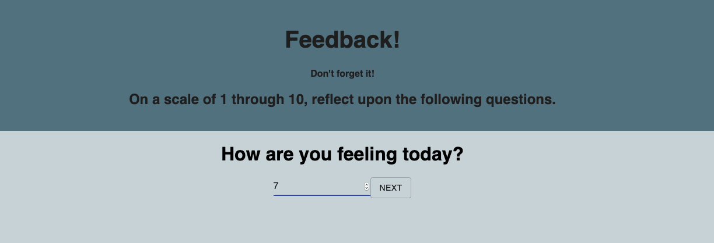
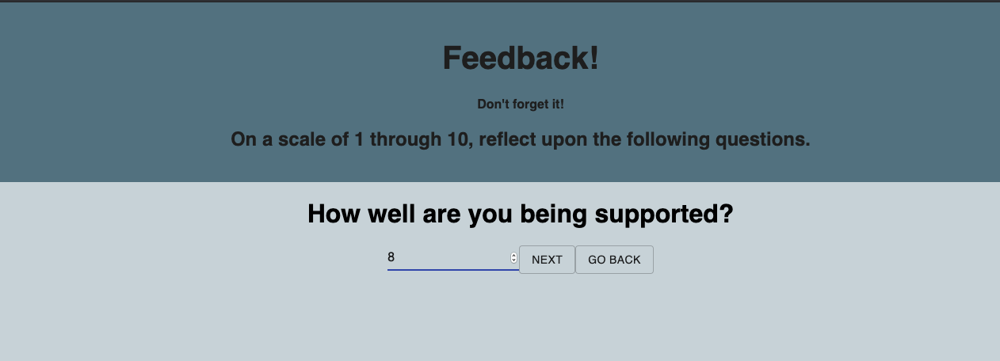
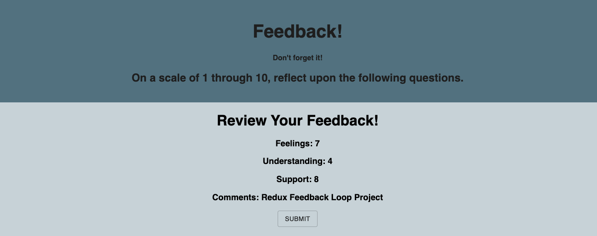
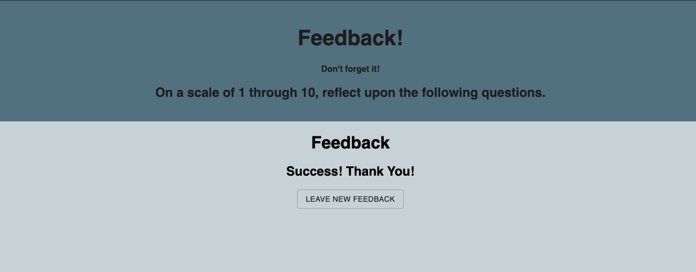

# REDUX FEEDBACK LOOP PROJECT

## Description

Prime Digital Academy week 11 Weekend Challenge

This project took me about 6 hours for it's current state. In this project we had to create multiple feedback pages where have information to be stored then sent to the database. We had to create server side as well as client side. To do this we had to use Axios to GET and POST information to our database. Hashrouters were required to move along pages, as well as back. Knowledge of using props as well as dispatch to access our store was crucial to having data sent successfully. The end product will allow you to go along multiple pages, store data, display all data on a review page, then submit it all to the database all while looping back to the first page to send data again as needed.

## Screen shots

# Installation

## BASIC SET UP
[x] -npm install, npm install react-redux, react-router-dom
[x] -organize basic folders
[x] -setup database
[x] -set up redux

## CREATE PAGES
[x] -create components, page 1, 2, 3, 4, review, feedback
[x] -import into app.js

## SET UP APP
[x] -set up hashrouters making sure to import
[x] -render props that way you can link through next buttons
[x] -set up connect and reduxState
[x] -setup state for feedback for GET
[x] -GET func to display current postico data
[x] -GET server side set up with route

## SET UP PAGES
[x] -component basics, set up next click and input fields
[x] -handleClick makes links move correctly

## REDUX / PAGES
[x] -set initial state to objects of page responses
[x] -set Store and Provider basics
[x] -Page One set up with handleChange for type and property
    [x] -make sure properties are 1-10
[x] -have dispatch sent through APP, to PAGES to send back type and action
[x] -REDUX set up if statements, change redux state with return
[x] -repeat steps pages 1-4

## REVIEW / FEEDBACK
[x] -send reduxState down to review
[x] -display all current reduxState's
[x] -on click, send to redux
[x] -if statement, POST to DB
[x] -feedback reset info

## STRETCH UPDATE SCORES
[x] -button that links to previous page and removes that pages data
[x] -push history to previous link

## MATERIAL UI
[x] -npm install @material-ui/core
[x] -import Button and TextField

## BUILT WITH

* Javascript * React * React-Redux * HTML * CSS * Axios * Material UI 

## Acknowledgement

Thanks to Prime Digital Academy and my Cohort Lamport for helping me learn and succeed at such a fast speed. 

